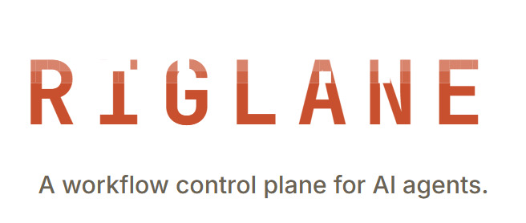
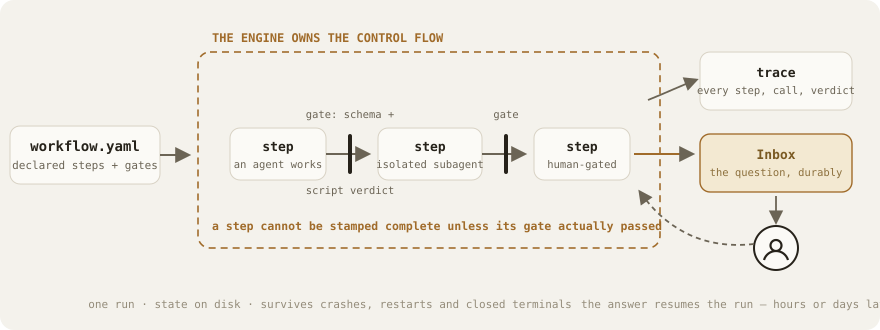
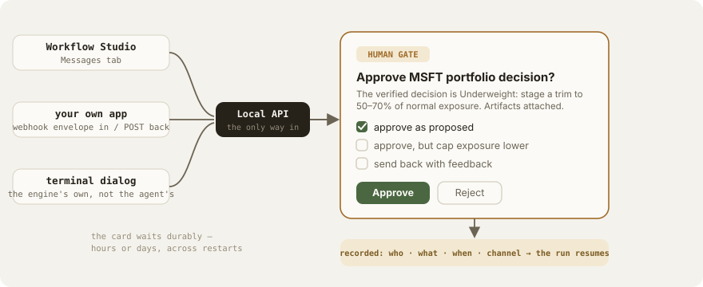
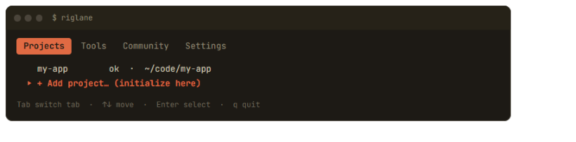
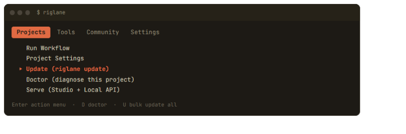

<p align="center">
  
</p>

<p align="center">
  <a href="https://www.npmjs.com/package/riglane"></a>
  <a href="LICENSE"></a>
  <a href="https://riglane.dev/docs/"></a>
  <a href="https://riglane.dev/try/"></a>
  <a href="https://riglane.dev/workflows/"></a>
  
</p>

**Riglane** turns an AI coding agent from "a chat that edits files" into a **process you can trust**: workflows are declared as explicit steps, **hard gates** stand between them, and every run leaves a **trace you can prove** — who did what, what was checked, who signed off. It runs on the agent host you already use; no LLM API key, no cloud.

<br>

<p align="center">
  
</p>

## See it live — no install

**[riglane.dev/try](https://riglane.dev/try/)** hosts the real **Workflow Studio**, loaded with a twelve-role trading-research workflow frozen mid-run: click through the workflow graph (five parallel lanes, conditional routes, a join barrier), the live trace, and the Inbox — where the run is waiting, durably, on a human signature.

## Identical behavior on every host

| Host | | Host | |
|---|---|---|---|
| **Claude Code** | ✅ | **OpenCode** | ✅ |
| **Cursor** (IDE + CLI) | ✅ | **GitHub Copilot** (CLI + VS Code) | ✅ |
| **Codex** (OpenAI CLI) | ✅ | **Gemini CLI** | ✅ |

Same workflow definition, same gates, same trace. *Instruction is not guarantee* — the rules live in the engine, not in the prompt, so an agent cannot skip a step, reorder them, or stamp one complete when its gate failed.

## Humans in the loop, durably

A human-gated step **waits** — structurally, not politely. The question lands in the run's Inbox; the answer can arrive from the Studio, from your own app over a webhook, or from a terminal dialog — all through one Local API endpoint, recorded by the engine with who, what, when and channel. Hours or days later, the answer resumes the run from exactly that step.

<p align="center">
  
</p>

## Getting started

```bash
npm install -g riglane
```

Then run `riglane` with no arguments — the interactive TUI covers everything below from menus. Point it at a project:

<p align="center">
  
</p>

`riglane init .` (the CLI equivalent) installs the adapter files (`.riglane/`, `.claude/`, `.cursor/`, …), wires the MCP servers and hooks, and registers the project. Restart your agent host, then:

```
/riglane-run-workflow gate-hook-check
```

`gate-hook-check` is a self-test workflow that proves the gates actually fire in your setup.

### Updating

First the package, then each project (`my_workflows` are preserved):

<p align="center">
  
</p>

```bash
npm update -g riglane
riglane update .          # in each project — or the TUI menu above
```

`riglane doctor` flags a project that drifted behind the installed package.

### Sharing workflows

The **[catalog](https://riglane.dev/workflows/)** distributes workflows as pointers with verified, byte-locked capability inventories — you see every command a workflow can execute *before* you install it, it lands switched off, and trusting it is a separate, deliberate act. `riglane search`, `riglane add <id>`, `riglane trust <id>`.

📚 Full documentation: **[riglane.dev/docs](https://riglane.dev/docs/)** — workflows, gates, script tools & structs, lanes/routes/loops, the Inbox, specs, architecture.

### From source

```bash
git clone https://github.com/riglane/riglane.git
cd riglane && npm install && npm run build && npm link
```

Node.js 20.10+ required.

## Getting help

- **How does something work?** → [Discussions → Q&A](https://github.com/riglane/riglane/discussions/categories/q-a)
- **Something differs from the docs?** → [open an issue](https://github.com/riglane/riglane/issues/new/choose). Include the harness and its version, the workflow, and the trace if the run wrote one.
- **A security problem?** → **privately**, never a public issue: see [SECURITY.md](SECURITY.md).

Maintained by one person: issues get read, not always quickly. `riglane doctor` and `/riglane-run-workflow gate-hook-check` answer a surprising share of questions faster than a thread.
